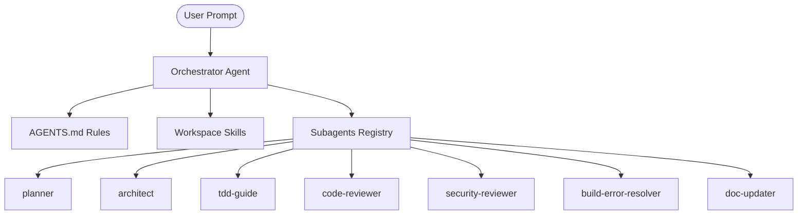

# Technical Documentation: Google Antigravity Agentic System

This document outlines the architecture, setup, and usage of the agentic orchestration system designed and implemented for the Google Antigravity environment. The design is modeled after the `everything-claude-code` framework, adapted to leverage Antigravity's native **Rules**, **Skills**, and **Subagents** mechanisms.

---

## 1. System Architecture

The agentic system operates through three primary layers:
1. **Orchestration Rules (`AGENTS.md`)**: Project-scoped constraints, guidelines, and triggering heuristics that define the workflow and quality gates.
2. **Workspace Skills (`skills/`)**: Modular, trigger-matched instructions containing specific development, verification, security, and reflection patterns.
3. **Session Subagents**: Specialized, scoped AI instances registered via `define_subagent` and coordinated by the main orchestrator agent.



---

## 2. Directory Layout

The workspace files are hosted in the project-scoped customization directory:

```
.agents/
├── AGENTS.md                          # Main project rules and guidelines
└── skills/
    ├── setup-agents/
    │   └── SKILL.md                   # Agent definition and registration routine
    ├── strategic-compact/
    │   └── SKILL.md                   # Boundary context compaction guidance
    ├── tdd-workflow/
    │   └── SKILL.md                   # Red-Green-Refactor test cycle
    ├── verification-loop/
    │   └── SKILL.md                   # Quality gates checklist (Build, Types, Lint, etc.)
    ├── security-review/
    │   └── SKILL.md                   # Checklist-based vulnerability checks
    └── continuous-learning/
        └── SKILL.md                   # Reflection and new skill extraction pattern
```

---

## 3. Workspace Customization Rules (`AGENTS.md`)

The [.agents/AGENTS.md](file:///Users/paulheise/Library/CloudStorage/GoogleDrive-pjheise@gmail.com/Mijn Drive/_BUSINESSES/_AI/AntiGravity Projects/AgenticSystemNew/.agents/AGENTS.md) file acts as the baseline prompt addition for all developer interactions in this repository. It establishes:
* **Strict Immutability**: All edits must avoid in-place mutations in favour of functional updates.
* **Modularity**: Limits typical file sizes to 200–400 lines (max 800 lines) and functions to under 50 lines.
* **Cascading Subagent Flows**: Defines standard workflows (e.g. Planning $\to$ Architecture $\to$ Testing $\to$ Code Review $\to$ Documentation).

---

## 4. Workspace Skills Reference

Each subdirectory under `.agents/skills/` contains a `SKILL.md` file equipped with frontmatter metadata used by Antigravity for automated discovery:

### 4.1. Setup Agents (`setup-agents`)
* **Trigger**: Prompts relating to initializing or configuring the orchestration workspace and registering subagents.
* **Functionality**: Instructs the main agent to run `define_subagent` calls for the 7 core specialized roles.

### 4.2. Strategic Compaction (`strategic-compact`)
* **Trigger**: Prompts requesting context management, optimization, or compaction.
* **Functionality**: Guides the model to request manual compaction exclusively at task boundaries (e.g. after planning is accepted or when a major compile error is resolved) rather than mid-implementation.

### 4.3. Test-Driven Development (`tdd-workflow`)
* **Trigger**: Implementation of new features, bug fixes, or refactoring.
* **Functionality**: Guides the agent through writing failing unit/integration/E2E tests, implementing minimal functional code, verifying test suite execution, and refactoring.

### 4.4. Verification Loop (`verification-loop`)
* **Trigger**: Before marking tasks as complete, submitting pull requests, or committing changes.
* **Functionality**: Runs a comprehensive quality gate checklist covering compilation, syntax/type checking, code linting, test suite execution, secret scanning, and git diff inspection.

### 4.5. Security Review (`security-review`)
* **Trigger**: Code auditing, secret scanning, or input validation checks.
* **Functionality**: Standardizes checks for parameterized queries, secret leaks, XSS/HTML injection, CORS bounds, and system details leakages in endpoint error payloads.

### 4.6. Continuous Learning (`continuous-learning`)
* **Trigger**: Session reflection, learning extraction, or creating learned behaviors.
* **Functionality**: Analyzes debug sessions or workaround traces to automatically package and write new learned skills to `.agents/skills/learned/`.

---

## 5. Subagents Specification

Subagents are defined inside the session using `define_subagent` with the configurations detailed below:

| Subagent Name | Scope / Purpose | Code Execution / Write Permissions | MCP Access |
|:---|:---|:---:|:---:|
| `planner` | Requirements gathering and implementation step breakdown | ❌ No | ❌ No |
| `architect` | Technical layout, patterns selection, and ADR creation | ❌ No | ❌ No |
| `tdd-guide` | Red-Green-Refactor execution and test writing | **Yes** | **Yes** |
| `code-reviewer` | Style and coding standards compliance checking | ❌ No | ❌ No |
| `security-reviewer`| Vulnerabilities audit and secret verification | ❌ No | ❌ No |
| `build-error-resolver`| Incremental build failures diagnostics and repair | **Yes** | **Yes** |
| `doc-updater` | Project docs and comments synchronization | **Yes** | ❌ No |

---

## 6. How to Use the System

### 6.1. Skill Discovered Automatically
Antigravity automatically discovers the skills stored in the `.agents/skills/` directory. For example, if you say:
> "Run verification on my recent changes"

The agent matches the request to the `verification-loop` skill, loads the checklist, and walks through the steps.

### 6.2. Bootstrapping Subagents
To ensure all specialized subagents are loaded and registered in your current chat session:
1. Trigger the `setup-agents` skill.
2. The agent will execute the `define_subagent` tool calls in sequence.
3. You can verify the active subagents using:
   - `/subagents` (if supported by UI)
   - Or by asking: "List the registered subagents in this session."

### 6.3. Invoking a Subagent
Once registered, the subagents can be spawned by name to complete scoped tasks. For example, to delegate a security review of a file:
```python
invoke_subagent(
    Subagents=[{
        "TypeName": "security-reviewer",
        "Role": "Security Auditor",
        "Prompt": "Perform a security scan on src/controllers/auth.ts and verify there are no hardcoded secrets or injection risks."
    }]
)
```
When the subagent completes its analysis, it reports back with its summary, minimizing context window usage on the main orchestrator agent.
